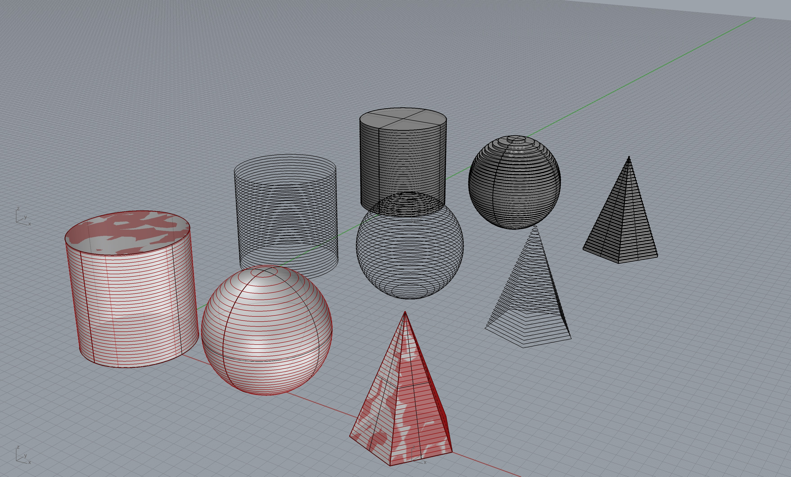
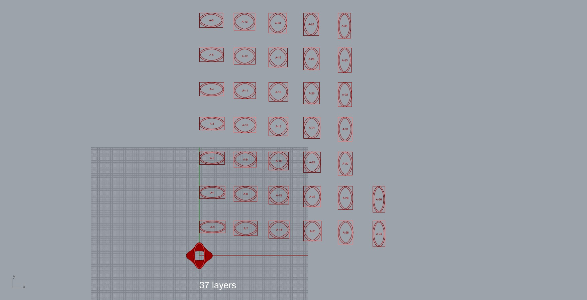
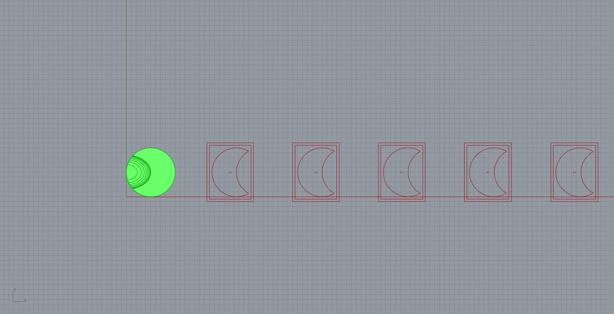
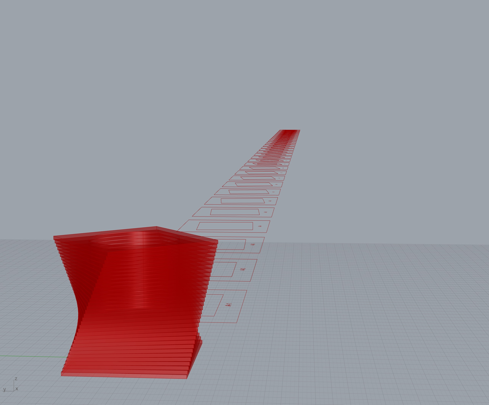
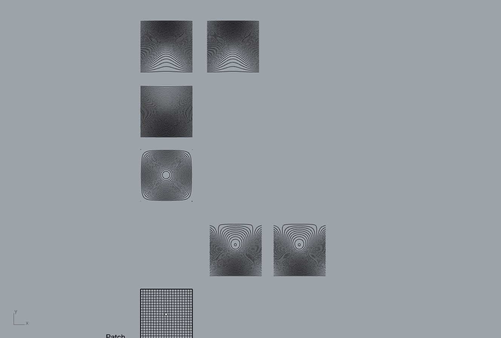
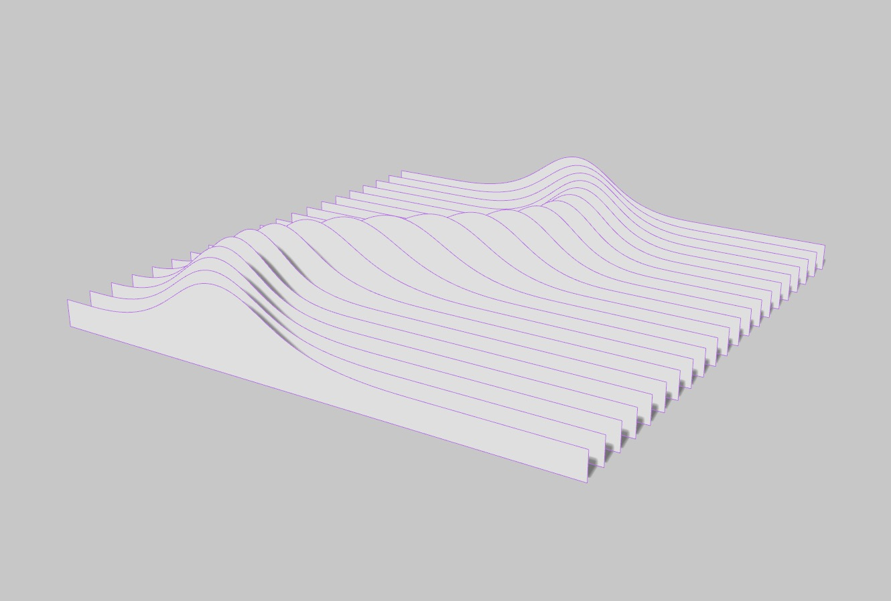

# cm-contour
Examples of contouring and slicing

## gh-basic-contour

## gh-layout-contours-grid

## gh-layout-contours-linear

## gh-layout-vessel-contours-linear

## surface-contours

## vertical-contours
